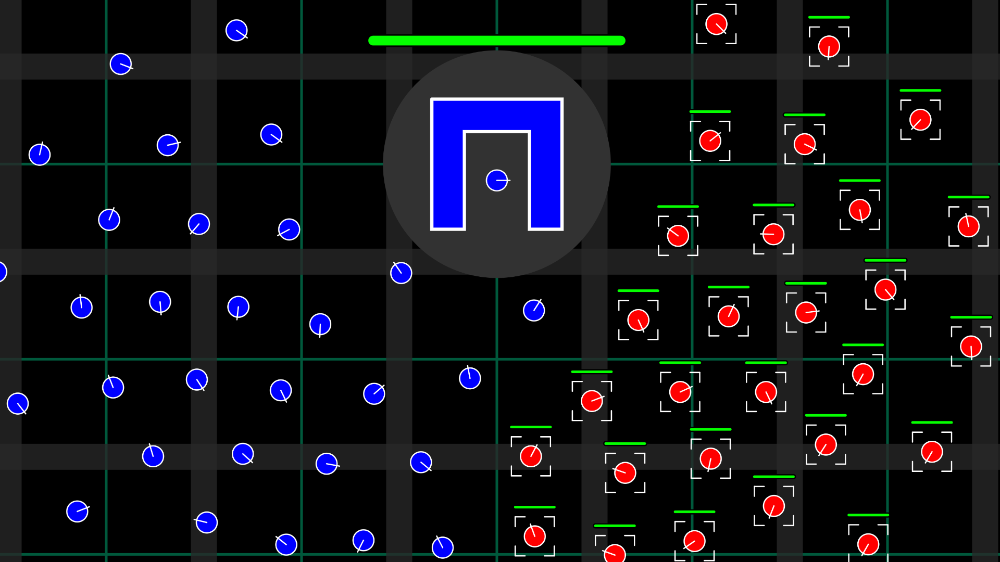

# RTS Game

A 2-player serverless peer-to-peer real time strategy game using WebRTC and P5.js. The game itself features movable units, unit collision avoidance, projectiles, health bars, area damage etc.

---

## Live Demo

[**Click here to open the live webpage**](https://compro72.github.io/RTS-Game/)

---

## Features

- **Movable Units:** The user can select units using the A key or the draggable selection box and then send the selected units to a target position.
- **Scrollable Screen:** The viewport can be moved around using the arrow keys.
- **Unit Collision Avoidance:** When multiple units are near each other or a structure they automatically adjust their position to avoid collisions. This can be used to block opponent units from having a clear shot at the home structure.
- **Projectiles:** Units can shoot projectiles with area damage to the opponent units and structure. Projectiles are also synced through WebRTC.
- **Health Bars:** All units and structures have health bars that show their percent health remaining.

---

## Technical Description

To make a serverless connection between two devices using WebRTC, a session description protocol (SDP) and a list of interactive connectivity establishment (ICE) candidates are required. The SDP contains the format, media settings and network protocols of the device so that the other device can seamlessly open a data stream. The ICE candidates are derived from an external Session Traversal Utilities for NAT (STUN) server and provide the list of possible network addresses where the device can be reached. Both sides of the connection receive this message from the other side by the user manually sending it. This is done to keep the connection serverless. Once the connection is established, the game syncs units, projectiles and damage to the other player through the opened data channel. Additionally, it also adds target points for the other player to click and destroy.

---

## Future Improvements

* **Pausing:** By pausing the data stream and the game on both sides when a player has switched the tab would prevent the game from desyncing on both sides.
* **WebSockets Server:** Setting up a websocket server for initially connecting the players would remove the need to copy paste the SDP and ICE list from one player to another. This would provide instant connections.
* **Increase Players:** This game has simple mechanics making it scalable for more players. This would require a mesh network architecture if using peer-to-peer connections.
* **Game Mechanics:** By adding more game mechanics like building structures and more types of units, the game becomes more interesting for multiple people to play.

---

## How to Run Locally
1. Clone this repository or download the code.
2. Open `index.html` in any web browser.
